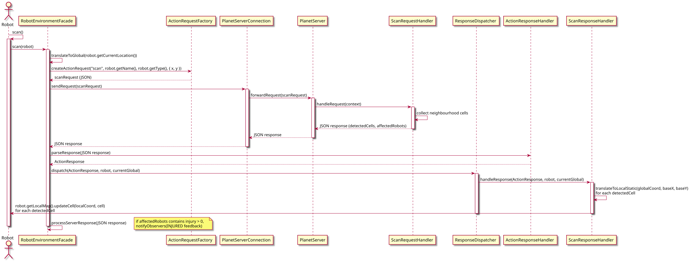
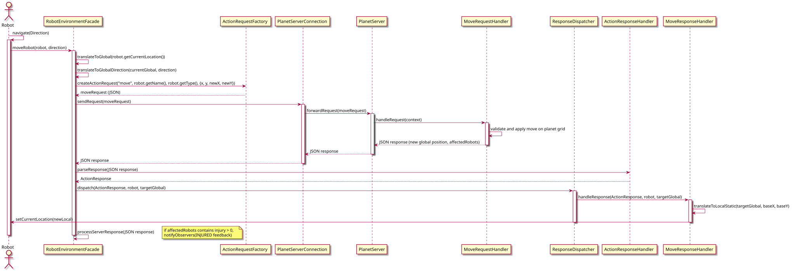

<!--
LV-223 (Colonization) multi-agent simulation

Copyright (c) 2019–2026 Alain Lebret (ENSICAEN)

SPDX-License-Identifier: MIT
-->

# Communication flow in the colony module

This document explains in detail how a robot in the colony sends a scan or move request to the planet server, how the request is built and transmitted, and finally how the response is parsed, dispatched, and propagated back to the robot. The explanation highlights the dedicated request building using the `ActionRequestFactory`, common response handling using the abstract class `AbstractResponseHandler` (with specialized implementations such as `ScanResponseHandler`, `MoveResponseHandler`, etc.), and a streamlined `RobotEnvironmentFacade` that focuses solely on communication and dispatching.

Note: This document focuses on the colony (client) side and the communication façade. Planet‐side processing (e.g. the server’s `RequestHandler` class and its subclasses) is not covered here.

---

## 1. Sending a scan request

### 1.1 Flow overview

1. **Robot action**  
   A robot calls its `scan()` method (defined in the abstract `Robot` class).
2. **Delegation to the facade**
   The `scan()` method invokes `environmentFacade.scan(this)`, passing the robot instance.
3. **Request building**
   The facade delegates request creation to the dedicated `ActionRequestFactory`. In particular:
   - The robot's current location is converted from local to global coordinates (using `translateToGlobal()`).
   - The factory is called with the robot's name, type, and global location to create a JSON string for the scan request.
4. **Sending the request**
   The facade sends the JSON request through the `PlanetServerConnection`.
   - The connection forwards the request to the planet server.
5. **Response reception and dispatch**
   When the response is received:
   - The `ActionResponseHandler` (using the shared JSON mapper) parses the JSON into an `ActionResponse` object.
   - The facade then dispatches the response to the appropriate handler (in this case, the `ScanResponseHandler`), which is an  implementation of the abstract base class `AbstractResponseHandler`.
   - The specialized handler logs the outcome and updates the robot's state (for example, by extracting detected cell data).
6. **Robot update**
   Finally, the robot (as an `EnvironmentObserver`) receives the corresponding `EnvironmentFeedback` and updates its local map.

### 1.2 Sequence diagram for scan

Below is the detailed sequence diagram for the scan request:

---

## 2. Sending a move request

### 2.1 Flow overview

1. **Robot action**
   When a robot calls its `navigate(Direction direction)` method, it wishes to move (e.g. a `Cartographer` deciding to move north).
2. **Delegation to the facade**
   The `navigate()` method calls `environmentFacade.moveRobot(this, direction)`. After sending the move request, the robot's local state is updated accordingly.
3. **Request building**
   Inside `moveRobot()`, the new global coordinates are calculated from the robot's current location and the given direction using `calculateNewGlobalCoordinates()`, which calls `translateToGlobalDirection()`.
   The facade then delegates the creation of the JSON move request to the `ActionRequestFactory`.
4. **Sending the request**
   The JSON "move" request is sent using the `PlanetServerConnection`, which forwards it to the planet server.
5. **Response reception and dispatch**
   When a response is received, the `ActionResponseHandler` parses it, and the facade dispatches the response to the `MoveResponseHandler` (a subclass of `AbstractResponseHandler`) which then updates the robot's internal state (for example, by converting the new global coordinates back to local coordinates).
6. **Post-move update**
   Finally, the robot is notified of its new state, and it may trigger a new scan to update its local map.

### 2.2 Sequence diagram for move

Below is the detailed sequence diagram for the move request:

## 3. Summary of impacted classes and methods

### Classes and methods involved in a scan

- **`Robot`** (abstract class):
  - `scan()`: Calls `environmentFacade.scan(this)`.
  - `update(EnvironmentFeedback feedback)`: Updates the local map if feedback type is `SCAN_RESULT`.
- **`RobotEnvironmentFacade`**:
  - `scan(Robot robot)`: Delegates the scan action.
  - `createScanRequest(...)`: Uses `ActionRequestFactory` to build the JSON.
  - `processScanResponse(...)`: Parses the response using `ActionResponseHandler` and dispatches it to `ScanResponseHandler`.
  - Helper methods: `translateToGlobal()`, etc.
- **`ActionRequestFactory`**:
  - `createActionRequest()`: Builds JSON strings for all actions using the shared, configured `ObjectMapper`.
- **`ActionResponseHandler`**:
  - `parseResponse()`: Parses JSON responses.
  - `processResponse()`: Provides fallback processing.
- **`ScanResponseHandler`** (extends `AbstractResponseHandler`):
  - `updateRobotState()`: Updates robot state based on scan results.
- **`PlanetServerConnection`**:
  - `sendRequest(String request)`: Sends JSON and receives a response.

### Classes and methods involved in a move

- **`Robot`**
  - `navigate(Direction direction)`: Calls `environmentFacade.moveRobot(this, direction)` then triggers a scan.
- **`RobotEnvironmentFacade`**:
  - `moveRobot(Robot robot, Direction direction)`: Builds the move request (using `ActionRequestFactory`), sends it, and dispatches the response.
  - `createMoveRequest()`: Builds the move request JSON.
  - Uses helper methods: `translateToGlobal()`, `calculateNewGlobalCoordinates()`, etc.
- **`MoveResponseHandler`** (extends `AbstractResponseHandler`):
  - `updateRobotState()`: Converts the new global coordinates to local coordinates and updates the robot's state.
- Other common classes:
  `EnvironmentFeedback`, `ResponseHandler` (and its abstract base `AbstractResponseHandler`) provide unified response processing.
- **`JsonUtils`** centralizes JSON mapping.

## 4. Conclusion

This document has outlined in detail the flow of messages for both scan and move actions. The provided sequence diagrams and class/method breakdowns should help you understand:

- How a robot initiates a scan or move.
- How the `RobotEnvironmentFacade` builds and sends the corresponding JSON requests.
- How the server's response is processed and forwarded back to update the robot's internal state.

By studying the code skeleton and these diagrams, you should be able to implement robust strategies for exploration, pathfinding, and collaborative behavior among agents.
