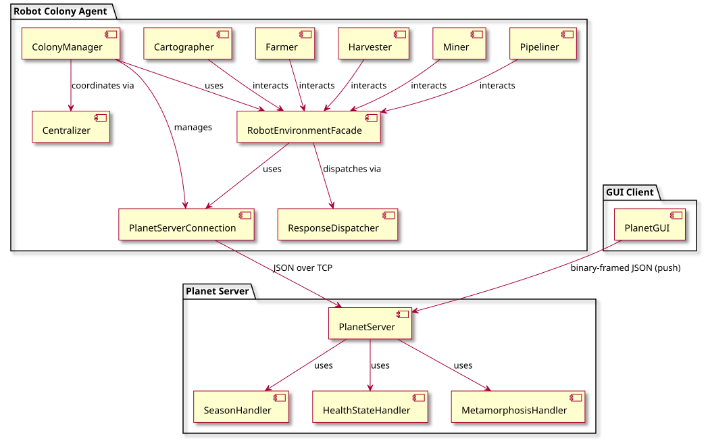
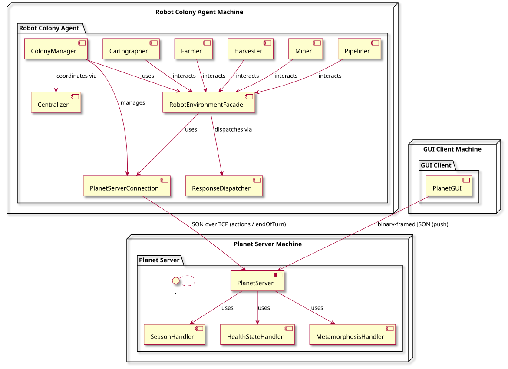
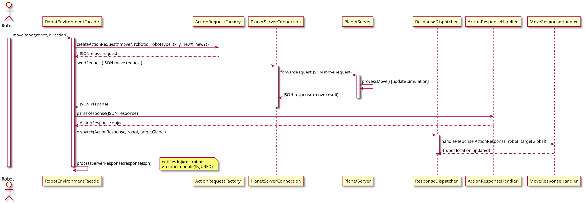
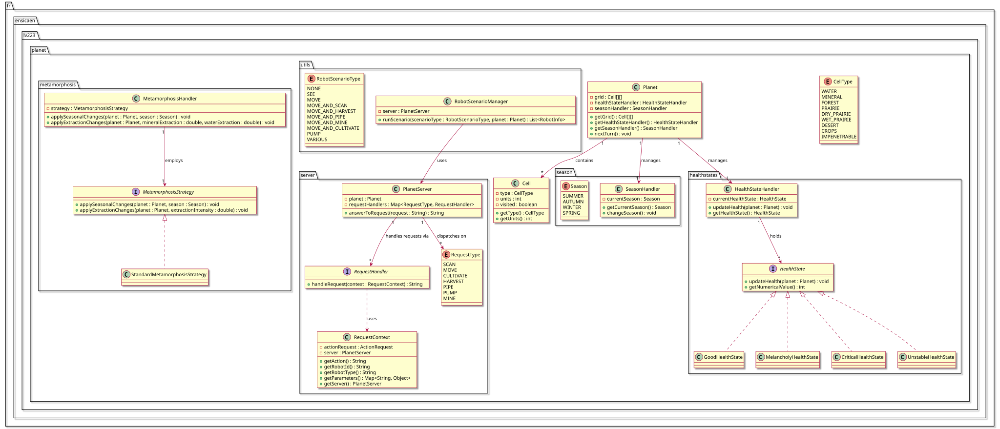

<!--
LV-223 (Colonization) multi-agent simulation

Copyright (c) 2019–2026 Alain Lebret (ENSICAEN)

SPDX-License-Identifier: MIT
-->

# LV-223 Project Architecture Guide

This document describes the organization and usage of the **LV-223** project, with a particular focus on the server that simulates a dynamic planet. The main objective is to provide a solid foundation for developing your own artificial intelligence strategies within a multi-agent simulation.

---

## Table of contents

1. [Introduction](#introduction)
2. [Overall architecture](#overall-architecture)
3. [Communication protocol](#communication-protocol)
4. [Design patterns and technical choices](#key-design-patterns-and-technical-choices)
5. [Instructions](#instructions)
6. [References](#references)

---

## 1. Introduction

The **LV-223** project aims to simulate the establishment of a robot colony on an evolving planet. This "living" planet experiences seasonal changes and metamorphoses induced by resource exploitation. The primary challenge is to develop AI strategies that enable robots to adapt in real time to an uncertain and ever-changing environment.

### Educational objectives

The project invites you to:

- Design and implement reinforcement learning strategies, pathfinding algorithms, and collaborative behaviors for the robots.
- Optimize navigation and resource exploitation in a dynamic environment.
- Experiment with adaptive behaviors using partial sensor data without full knowledge of the global environment.
- Focus on AI behavior development while relying on a pre-established communication infrastructure.

---

## 2. Overall architecture

### 2.1 General organization

The LV-223 project is structured in a modular way to enhance extensibility and maintainability while concentrating on AI strategy development. The system is divided into three main components:

- **Planet module**:  
  This module simulates the planet. It manages a grid representing various terrain types, resources, and environmental evolution (seasonal changes, metamorphoses, health status). The server, implemented by the `PlanetServer` class, exposes this data via a network interface and processes client requests.  
  *Note:* This module is provided almost entirely as-is; your primary focus will be on the colony side.

- **Colony module**:  
  This module contains the client-side logic for managing the robot colony. It provides a communication facade (the `RobotEnvironmentFacade` class) that constructs, sends, and processes requests to the server. Various robot types (e.g., `Cartographer`, `Miner`, `Harvester`, `Farmer`, `Pipeliner`, and `Centralizer`) are implemented here by extending the abstract `Robot` class.  
  Initially, the robot methods are either empty or contain minimal examples. You are expected to implement advanced AI strategies (reinforcement learning, pathfinding, collaboration) to improve their decision-making.
  
- **Graphical user interface**:  
  Developed in Python using Tkinter, the GUI provides real-time visualization of the planet and colony. It displays the grid, resource levels, health status, and the number of simulation turns, updating regularly based on messages received from the server.

### 2.2 Component diagrams and descriptions

#### Component diagram

The following component diagram illustrates the global architecture of the project and highlights the interactions between:

- **The planet and its server**:  
  - The `Planet` class models the terrain grid, seasons, health status, and metamorphoses.
  - The `PlanetServer` class receives and processes client requests (from the colony and GUI) and orchestrates the simulation.
  - Dedicated submodules manage seasonal transitions (`SeasonHandler`), health status (`HealthStateHandler`), and metamorphoses (`MetamorphosisHandler`).

- **The colony**:  
  - The `ColonyManager` class manages the connection to the server and schedules robot actions.
  - The `RobotEnvironmentFacade` serves as the single communication interface between the colony and the server, thereby decoupling the AI logic from network details.
  - Various robot classes implement specific strategies and communicate via this facade.

- **The graphical user interface**:  
  - The GUI connects to the server to receive regular updates, enabling real-time visualization of the simulation's evolution.



#### Deployment diagram

The deployment diagram below shows how the various components are distributed across machines or processes:

- The server can run on a dedicated machine and listens on a specified port (default: 12345).
- The colony client and the GUI connect to the server over the network using sockets and exchange JSON messages to synchronize the simulation state.



### 2.3 Data flow

Data exchanges are implemented using a standardized protocol based on JSON messages. The main flows include:

- **Requests from the colony**:  
  Robots, through the `RobotEnvironmentFacade`, send requests (e.g., `"move"`, `"scan"`, `"mine"`) constructed from their actions. These requests are transmitted to the server using the `PlanetServerConnection` class.

- **Responses from the server**:  
  The server processes each request using specific handlers (e.g., `MoveRequestHandler`, `ScanRequestHandler`) and returns a JSON response indicating the operation's result, the updated simulation state (grid, affected robots, etc.), and error messages if applicable.

- **Updates to the GUI**:  
  The GUI also connects to the server to receive global updates (grid, resources, pipelines, etc.), enabling real-time visualization of the simulation's progress.

### 2.4 Server lifecycle

The server (implemented in the `planet` module) orchestrates the simulation and ensures synchronization between the planet, colony, and GUI. Its lifecycle consists of three main phases:

1. **Startup**:
   - The `Main` class instantiates a `Planet` object using a JSON configuration file that defines the grid, terrain types, and environmental parameters.
   - A `PlanetServer` object is created with the `Planet` instance and configuration (`Config`). The server opens a listening socket (default port 12345) and initializes the set of request handlers (classes derived from `RequestHandler`).
   - In demonstration mode, a scenario manager (`RobotScenarioManager`) may be activated to simulate predefined behaviors.

2. **Simulation loop**:
   - A dedicated thread runs the simulation loop, where each iteration represents a simulated day.
   - In each turn, the server calls `nextTurn()` on the `Planet` object, which handles:
     - Seasonal changes via the `SeasonHandler`.
     - Application of metamorphoses via the `MetamorphosisHandler`.
     - Updates to the planet’s health via the `HealthStateHandler`.
     - Resource refresh (e.g., water replenishment).
   - After these updates, the server converts the planet’s state into a JSON message and broadcasts it to clients using `sendUpdatesToClients()`.
   - Synchronization is achieved by waiting for an `"endOfTurn"` message (or an acknowledgment from the GUI in demo mode) before proceeding to the next turn.

3. **Shutdown**:
   - Once the total number of turns (calculated as the number of simulated years multiplied by the number of days per year) is reached, the server sends a final update indicating the end of the simulation, stops the loop, and closes all network connections.

#### Sequence diagram for a "move" request

The following sequence diagram illustrates, in simplified form, the interaction during a `"move"` request—from the robot’s initiation to the final synchronization between the server and clients.



#### Simplified class diagram (planet module)

Below is a simplified class diagram showing the main classes of the `planet` module:



---

## 3. Communication protocol

Communication between the colony (or GUI) and the planet is carried out using JSON messages sent over sockets. This approach ensures a clear separation between the business logic (robot strategies and planet simulation) and the communication layer.

### Message format

Each message, whether a request or a response, follows a standardized JSON structure that describes:

- **"action"**: The operation to perform (e.g., `"move"`, `"scan"`, `"mine"`, `"harvest"`, `"cultivate"`, `"pipe"`, `"pump"`, `"endOfTurn"`).
- **"robotId"**: The unique identifier of the robot performing the action.
- **"robotType"**: The type of the robot (e.g., `"Cartographer"`, `"Miner"`, `"Harvester"`, `"Farmer"`, `"Pipeliner"`).
- **"parameters"**: An object containing the parameters specific to the action (coordinates, units, etc.).

#### Example request: "move"

```json
{
  "action": "move",
  "robotId": "R1",
  "robotType": "Cartographer",
  "parameters": {
    "x": 10,
    "y": 10,
    "newX": 10,
    "newY": 11
  }
}
```

#### Example request: "scan"

```json
{
  "action": "scan",
  "robotId": "R2",
  "robotType": "Cartographer",
  "parameters": {
    "x": 5,
    "y": 5
  }
}
```

#### Example request: "endOfTurn"

```json
{
  "action": "endOfTurn"
}
```

### General structure of a response

Server responses include the following fields:

- `"status"`: `"success"` or `"error"`.
- `"action"`: The action the response refers to (e.g., `"move"`, `"scan"`). In case of an error, this field may be empty.
- `"message"`: A brief description of the result (especially in case of an error).
- `"affectedRobots"`: A list of objects describing the robots affected by the action (ID, type, injury level).
- `"detectedCells"`: A list of objects describing the state of the detected cells (coordinates, type, units) after a `"scan"`.

#### Example response: "move"

```json
{
  "status": "success",
  "action": "move",
  "message": "Move completed successfully.",
  "affectedRobots": [
    {
      "id": "R1",
      "type": "Cartographer",
      "injury": 0
    }
  ],
  "detectedCells": []
}
```

#### Example response: "scan"

```json
{
  "status": "success",
  "action": "scan",
  "message": "",
  "affectedRobots": [
    {
      "id": "R2",
      "type": "Cartographer",
      "injury": 0
    }
  ],
  "detectedCells": [
    { "x": 4, "y": 4, "type": "forest", "units": 100 },
    { "x": 4, "y": 5, "type": "prairie", "units": 200 }
    // ... additional neighboring cells
  ]
}
```

### Role of the communication façade

The `RobotEnvironmentFacade` class (in the `colony` module) is one of
the main components of the client-side communication protocol. Its
responsibilities include:

- **Constructing requests**:
  It converts robot actions into JSON messages. For example, when a
  robot calls `moveRobot()`, the façade constructs a request that
  includes its current and destination coordinates.
- **Sending messages**:
  It uses the `PlanetServerConnection` class to transmit requests
  through a socket. The `sendRequest()` method ensures that the
  connection is active.
- **Processing responses**:
  Upon receiving a response, the façade converts the JSON into a
  corresponding Java object (e.g., `ActionResponse`) and notifies
  the robots of the results, enabling error handling and strategy
  adaptation.
- **Notifying observers**:
  Using the observer pattern, when a change occurs (e.g., after a
  `"scan"`), all registered robots are notified so they can update
  their behavior accordingly.

### Error handling

To ensure system robustness, the protocol incorporates:

- Input validation:
  Each request is validated (e.g., coordinates must fall within the grid, units
  must be within an acceptable range) to reduce processing errors.
- Explicit error messages:
  In the event of an error, the server returns a response with `"status": "error"`
  and a descriptive message (e.g., "Invalid cell coordinates" or "Insufficient resources").
- Exception management:
  Both the façade and the `PlanetServerConnection` class capture and log exceptions
  to facilitate debugging.
- Timeout and synchronization:
  Synchronization mechanisms ensure that the server waits for client responses
  before advancing to the next turn. In case of excessive delay, a warning is logged,
  and the server proceeds to the next turn.

---

## <a name="principaux-patrons-et-choix-techniques"></a> 4. Design patterns and technical choices

The project is built on a modular architecture and leverages several design
patterns to ensure flexibility, extensibility, and robustness. This section
details the primary patterns and technical choices that guided the design of
the simulation.

### 4.1 Design patterns

#### 4.1.1 Observer

Used to inform robots of changes in the environment (e.g., after a `"scan"`).

**Implementation**:

- The `RobotEnvironmentFacade` class acts as the subject.
- Robots (or other entities) subscribe using the `subscribe()` method.
- When a response is received, an `EnvironmentFeedback` object is created and broadcast to all subscribers.

Advantage: This pattern decouples business logic from communication, promoting a reactive architecture.

#### 4.1.2 Facade

Isolates network communication logic from the business logic of the robots.

**Implementation**:

- The `RobotEnvironmentFacade` class serves as the single interface between the colony and the server.
- It is responsible for constructing JSON messages, sending requests through `PlanetServerConnection`, and processing responses.

Advantage: This pattern allows developers to focus on developing AI strategies (e.g., exploration, pathfinding, reinforcement learning) without being distracted by network communication details.

#### 4.1.3 Strategy

Allows the management of dynamic behaviors based on context (particularly for the planet's metamorphosis).

**Implementation**:

- In the `planet` module, the `MetamorphosisHandler` utilizes the `MetamorphosisStrategy` interface.
- The `StandardMetamorphosisStrategy` is a concrete implementation that adjusts terrain based on seasonal changes and resource extraction intensity.

**Advantage**: This approach permits experimentation with different strategies for the evolution of the planet, thus enabling observation of how the environment influences robot performance.

### 4.2 Technical choices

- Languages and technologies:
  - Java (JDK 8+ or 11+) for the planet and colony modules.
  - Python (Tkinter) for the graphical user interface.
  - Maven for project management and dependency handling.
- Network communication:
  - Sockets and JSON are used for message exchange, ensuring a clear separation between simulation logic and communication.
- Configuration management:
  - Simulation parameters (e.g., grid dimensions, resource quantities) are loaded from a JSON file, allowing easy modifications without altering the source code.

---

## <a name="instructions"></a> 5. Instructions

This section provides practical guidelines for installing, compiling, running, and extending the project.

### 5.1 Installation and compilation

#### Prerequisites

- A recent version of the JDK (8, 11, or higher) must be installed.
- Maven (version 3 or later) is required for dependency management and compilation.
- For the graphical interface, Python 3 and Tkinter must be installed.

#### Compilation

From the project root (where the main "pom.xml" is located), run the following Python script to compile all modules:

```sh
python3 scripts/compile.py
```

### 5.2 Running the project

Two Python scripts are available in the "scripts" folder:

- `run_alone.py`: Launches the server (`planet` module) in standalone mode.
- `run_with_colonie.py`: Simultaneously launches the server and the colony client.

#### Running server in demo mode (`planet` module)

To start the server in demonstration mode, execute:

```sh
python3 scripts/run_alone.py --years=1 --delay=1000 --scenario=move --port=12345 --config=target/classes/json/planet2.json
```

Available options:

- `--years=<N>`: Number of years to simulate (default: 8).
- `--delay=<ms>`: Delay between simulation turns (default: 1000 ms).
- `--scenario=<type>`: Demo mode scenario (e.g., "move", "mine", "scan", etc., or "none" for normal mode).
- `--port=<port>`: Server listening port (default: 12345).
- `--config=<path>`: Path to the JSON configuration file.

#### Running colony (`colony` module)

To start the colony client, navigate to the colony folder and execute:

```sh
python3 ../scripts/run_with_colonie.py
```

This launches the server and begins the robot scheduling.

#### Running graphical user interface

To launch the GUI, navigate to the "planet-gui" folder and execute:

```sh
python3 src/planet_gui.py
```

Note: Connection parameters (host and port) are hardcoded in the script and can be modified if necessary.

### 5.3 Project structure

Below is an overview of the project structure:

```sh
lv223/
 ├─ pom.xml                   # Main POM (lists modules)
 ├─ planet/                   # Planet server module (planet simulation)
 │   └─ src/main/java/fr/ensicaen/lv223/planet/ ...
 ├─ colony/                   # Client module (robot colony)
 │   └─ src/main/java/fr/ensicaen/lv223/colony/ ...
 ├─ planet-gui/               # Graphical Interface
 │   └─ src/planet_gui.py
 └─ scripts/                  # Python Scripts
     ├─ compile.py
     ├─ run_alone.py
     └─ run_with_colonie.py
```

Each module has its own "pom.xml" to allow for independent compilation and dependency management.

---

## <a name="references"></a> 6. References

- P. Cingolani, J. Alcalá-Fdez. "jFuzzyLogic: a Java Library to Design Fuzzy Logic Controllers According to the Standard for Fuzzy Control Programming", International Journal of Computational Intelligence Systems, 61-75, 2013.
- [Documentation Maven](https://maven.apache.org/guides/index.html)
- [Documentation Tkinter](https://docs.python.org/fr/3.13/library/tkinter.html)
