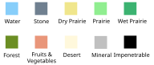
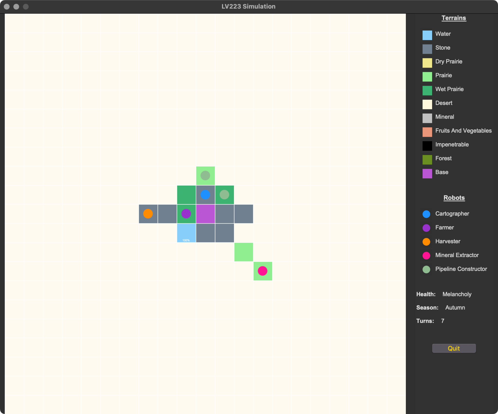
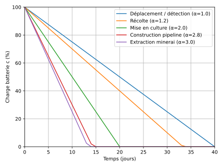
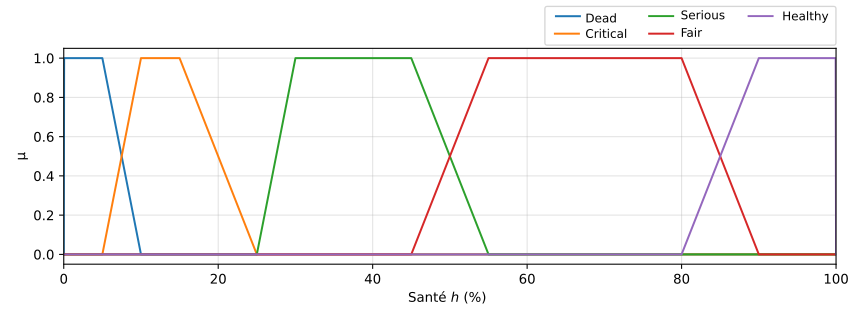
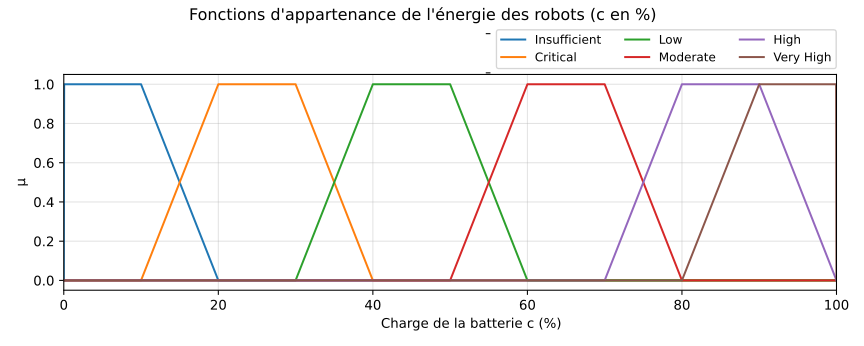

<!-- ----------------------------------------------------------------------- -->
<!-- ------------------------ Intelligence artificielle -------------------- -->
<!-- ------------------ Cours Ingénieur Informatique 2e année -------------- -->
<!-- ---------------------------- E N S I C A E N -------------------------- -->
<!-- -------------------------- Alain Lebret, 2026 ------------------------- -->
<!-- ----------------------------------------------------------------------- -->
<!-- Licensed under LICENSE-EDUCATION.md.                                    -->
<!-- Third-party assets must be declared in doc/THIRD_PARTY.md.              -->
<!-- ----------------------------------------------------------------------- -->

---
title: "Intelligence artificielle"
subtitle: "Projet LV-223 (v. 4.3)"
author: Alain Lebret
date: "2025-2026"
subject: "Projet LV-223"
keywords: [IA, AI, project]
lang: "fr"
mainfont: "Alegreya"
sansfont: "Lato"
monofont: "Fira Code Light"
mathfont: STIX Two Math
mainfontoptions: [Numbers = OldStyle, Ligatures = Rare]
titlepage: true
titlepage-rule-height: 0
titlepage-background: "./figures/bgm1.svg"
titlepage-text-color: "222222"
float-placement-figure: "H"
caption-justification: centering
code-block-font-size: \small
listings-disable-line-numbers: false
header-right: "2025-2026"
footer-left: "ENSICAEN"
header-includes:
  - |
    ```{=latex}
    \usepackage{awesomebox}
    \usepackage{fontawesome5}
    \usepackage[nameinlink]{cleveref}
    \usepackage[os=win]{menukeys}
    \usepackage{ccicons}
    \usepackage[listings]{tcolorbox}
    \definecolor{rouge_ensicaen}{RGB}{204,89,90}
    \definecolor{bleu_ensicaen}{RGB}{80,187,190}
    \definecolor{ocre_ensicaen}{RGB}{218,147,79}
    \definecolor{beige_ensicaen}{RGB}{180,182,111}
    \newtcolorbox{objective-box}{colback=white,colframe=bleu_ensicaen!10!darkgray,fonttitle=\bfseries,title=Objectif}
    \newtcolorbox{exercise-box}{colback=ocre_ensicaen!10,colframe=ocre_ensicaen,fonttitle=\bfseries}
    \newtcolorbox{info-box}{colback=cyan!5!white,arc=0pt,outer arc=0pt,colframe=cyan!60!darkgray}
    \newtcolorbox{warning-box}{colback=orange!5!white,arc=0pt,outer arc=0pt,colframe=orange!80!black}
    \newtcolorbox{error-box}{colback=red!5!white,arc=0pt,outer arc=0pt,colframe=red!75!black}
    ```
pandoc-latex-environment:
  noteblock: [note]
  tipblock: [tip]
  warningblock: [warning]
  cautionblock: [caution]
  importantblock: [important]
  objective-box: [objective]
  exercise-box: [exercise]
  tcolorbox: [box]
  info-box: [info]
  warning-box: [warning]
  error-box: [error]
...

::: objective
Mettre en oeuvre un système multi-agents afin d'exploiter l'écosystème d'une
planète tout en la préservant.\

**Pré-requis** : tout \
**Durée estimée** : quelques séances, mais jamais assez...
:::

[//]: # (----------------------------------------------------------------------)

# Présentation

::: note
À première vue, la planète LV-223 présentait toutes les conditions propices à
l'installation d'une colonie humaine. 
En 2093, un vaisseau spatial de la société internationale Elaune Mousque et 
composé de robots d'exploration y fut d'ailleurs envoyé de manière à installer
une base et à préparer son environnement immédiat.
Cette base avait pour but de garantir la survie d'une première vague de
dix-sept colons humains prévue huit ans plus tard.

Le vaisseau s'était posé sur un plateau rocheux *a priori* sécurisé de
la planète, et puis ...
:::

L'objectif de ce projet est de réaliser une application qui simule la
phase de préparation à la colonisation humaine à venir. La colonie de robots
prévoit de construire une infrastructure pérenne de pompage de l'eau, mais
aussi d'extraire des minerais, de collecter les légumes et les fruits 
comestibles s'ils existent et de produire de la nourriture sur les terrains 
qui le permettent, tout en préservant au mieux l'écosystème de la planète.
Toutefois, LV-223 va se révéler moins hospitalière que prévu. 
Vos robots parviendront-ils à sécuriser la base et son environnement avant
l'arrivée de la colonie prévue huit ans plus tard ?

Afin de réaliser ce projet, il vous faudra mettre en oeuvre les
connaissances vues en cours, en particulier les agents et systèmes
multi-agents, la logique floue, sans doute des algorithmes d'apprentissage
et de recherche.

## LV-223

LV-223 est une planète métamorphe dont l'atmosphère est très proche de 
celle de la Terre et qui présente un cycle climatique équivalent à la Terre
(quatre saisons : printemps, été, automne et hiver avec une période de 
révolution autour de son soleil de 364 jours et des journées de 24 h).
Elle bénéficie d'une vie végétale (entre autres des fruits et légumes
comestibles), ainsi que d'une vie animale à l'état embryonnaire
(notamment des *lumbricina* dans le sol meuble et différents insectes
pollinisateurs). La planète comprend plusieurs types de terrains comme
le montre la figure [1](#fig:types-terrain){reference-type="ref"
reference="fig:types-terrain"}.

{ #fig:types-terrain width="8cm"}

La planète peut être considérée comme un agent réactif muni d'un mécanisme
de mémorisation des évènements qu'elle endure, ainsi que d'un état de santé 
associé à la quantité et à la durée des évènements. Votre colonie se rendra 
rapidement compte qu'à chaque changement de saison, la planète subit un 
certain nombre de métamorphoses et que les actions de vos robots pourront 
elles aussi en induire.

### Exosquelette {#exosquelette .unnumbered}

Le coeur de la planète est constitué d'un exosquelette quasi rigide dont
l'origine se situe en son centre et dont les rayons aboutissent sur les
régions constituées de pierraille, sur celles contenant du minerai et
celles qui sont infranchissables, ainsi que sur les fonds marins des
lacs et des étangs. Le reste des régions de la planète repose sur un
sous-sol agrégé autour de l'exosquelette. Ces dernières peuvent, quant à
elles, subir des métamorphoses en fonction des modifications de 
l'environnement de la planète comme les changements de saisons, mais 
aussi comme vous vous en rendrez compte, lors de l'extraction de
minerai, ou encore lors du pompage de l'eau. Prenez garde !

### Minerai {#minerai .unnumbered}

Les régions contenant du minerai font partie intégrante de l'exosquelette 
de la planète. Une case de minerai contient **1000** unités de minerai. Tout 
prélèvement de minerai déstabilise l'exosquelette de la planète et risque 
de causer des métamorphoses sur une partie des régions transformables.

### Lacs et étangs {#lacs-et-étangs .unnumbered}

Les fonds des lacs et étangs font partie intégrante de l'exosquelette de
la planète. Une case de ce type de terrain représente **10000** unités d'eau. 
Tout pompage d'eau trop important est susceptible de déstabiliser aussi 
l'exosquelette de la planète et peut participer au risque de métamorphoses
sur une partie des régions transformables. 

### Autres terrains {#autres .unnumbered}

Les autres terrains ne font pas partie de l'exosquelette de la planète et
font donc partie des régions qui subissent les métamorphoses. La plupart 
de ces terrains n'offrent pas de ressources. Toutefois, les terrains de 
fruits et légumes possèdent **1000** unités que les robots peuvent 
collecter.
Quant aux cases de forêts, elles disposent de **1000** unités de ressources
de diverses essences de bois, mais elles ne seront pas exploitées dans
cette simulation. Sans doute un jour, le seront-elles aussi ? 

### Métamorphoses {#métamorphoses .unnumbered}

La métamorphose d'un terrain va entraîner la destruction de toute
construction s'y trouvant, par exemple, la portion d'un pipeline présente
sur ce terrain. De même, si un robot se trouve sur un terrain lors de sa
métamorphose, il peut alors subir des dégâts matériels (voir section
[1.2](#robots){reference-type="ref" reference="robots"} plus bas).

### Mémoire, état de santé et réaction {#mémoire-état-de-santé-et-réaction .unnumbered}

La planète possède une mémoire des métamorphoses qui ont pu influer sur
son état de santé. Toutefois, cette mémoire est sujette à l'oubli et est
inversement proportionnelle au temps qui la sépare de l'instant de la 
métamorphose.

Son état de santé peut prendre les valeurs suivantes : << bon >>, << mélancolique >>, 
<< instable >> et << critique >>. Avant l'arrivée des robots colonisateurs, la
planète se trouve dans l'état de santé << bon >> au printemps et en été, et
dans l'état de santé << mélancolique >> en automne et en hiver.
En fonction du nombre de métamorphoses qu'elle est amenée à subir sur une
période donnée, vous constaterez que la planète est susceptible de voir son
état de santé se dégrader.

## Robots d'exploration {#robots}

Au nombre de treize, nos robots d'exploration n'ont au départ aucune
connaissance des terrains qui environnent la base, ni des capacités
métamorphiques que possède LV-223. Progressivement, ils vont découvrir
la planète comme le montre la figure [2](#fig:terrain2){reference-type="ref" reference="fig:terrain2"}.

### Types de robots {#types-de-robots .unnumbered}

En plus de l'agent cognitif appelé << centralisateur >> et demeurant
dans la base, les robots rencontrés dans cette simulation comprennent :

-   des ouvriers (trois extracteurs de minerai, trois constructeurs de
    pipelines et trois récolteurs de nourriture) ;
-   deux agriculteurs ;
-   deux cartographes.

Ces robots sont des robots réactifs à mémoire capables de s'organiser afin 
d'accomplir des tâches plus ou moins complexes et de s'entraider. 

{#fig:terrain2 width="12cm"}

### Capteurs et effecteurs {#stratégie-de-déplacement .unnumbered}

Chaque robot réactif dispose d'un capteur de voisinage qui lui indique
le type de terrain pour les huit cases voisines ainsi que celle où il se
trouve (figure [3](#fig:capteurs){reference-type="ref" reference="fig:capteurs"}). 
La détection est réalisée à l'aide de la commande << `scan()` >> qui retourne la
liste des types pour la case courante et celles de son voisinage.

Tous les robots sont capables d'avancer d'une case à chaque tour à l'aide
de la méthode << `navigate()` >>, et ce dans une direction donnée (<< `NORTH` >>,
<< `SOUTH` >>, << `EAST` >>, << `WEST` >>, << `NORTHEAST` >>, << `NORTHWEST` >>,
<< `SOUTHEAST` >> et << `SOUTHWEST` >>). 

{#fig:capteurs width="3cm"}

De plus, l'origine du repère utilisé par les robots pour s'orienter correspond à
la base. 
 
Enfin, des effecteurs spécifiques permettent les actions suivantes :

- extraction de minerai (commande << `mine(units : int)` >>) ;
- récolte de nourriture (commande << `harvest(units : int)` >>) ; 
- culture d'un terrain (commande << `cultivate(water units : int)` >>) ; 
- construction de pipelines (commande << `pipe()` >>) ;
- pompage de l'eau qui est possible dès qu'au moins un pipeline relie un
  terrain contenant de l'eau à la base (commande << `pump(units : int)` >>). 

### Centralisateur {#centralisateur .unnumbered}

Dans sa version 1.0, le centralisateur est un agent cognitif positionné
dans la base et qui surveille l'évolution de l'exploration. Il collecte
les données fournies par les robots, comptabilise l'ensemble des
ressources ramenées par les extracteurs de minerai et les récolteurs de
nourriture, ainsi que la quantité d'eau stockée et sa consommation. Il
dresse au fur et à mesure de la simulation une carte des ressources de
la planète en fonction de l'information transmise, ainsi que celle du
réseau de pipelines.

::: note
Vos robots étant seuls à plusieurs années lumières de la Terre, pensez que
le système de communication entre vos robots et le centralisateur peut être
indisponible à certains moments. Vos robots doivent donc rester fonctionnels
même si la communication avec le centralisateur est indisponible pendant
plusieurs tours. C'est une question de suvie !
:::

### Cartographe {#cartographe .unnumbered}

Le cartographe est un drone autonome qui réalise la cartographie de la
planète en transmettant à chaque tour au centralisateur le type des
nouvelles cases survolées. Au départ, le cartographe n'a aucune idée de
la capacité de la planète à se métamorphoser, il adopte donc une
stratégie que vous définirez pour découvrir au mieux la planète.
Une stratégie attendue pour le cartographe consiste à maximiser la
découverte de cases inconnues par unité d'énergie consommée, tout en
anticipant les retours à la base pour se recharger avant l'épuisement
de la batterie. Une navigation optimale au sens des graphes n'est pas
attendue : le cartographe peut traverser toutes les cases, y compris
les zones infranchissables, et n'est pas affecté par les obstacles
et les métamorphoses.

### Extracteur de minerai {#extracteur-de-minerai .unnumbered}

L'objectif de ce type de robot est de collecter du minerai (notamment de
l'acier, du platine et du palladium qui sont présents en quantité sur la
planète) puis de le rapporter à la base afin qu'il y soit traité. 

Le robot est muni de détecteurs le renseignant sur la présence de minerai
sur la case courante ou sur une case de son voisinage. Il a en mémoire la 
localisation de la base où il devra rapporter le minerai collecté, ainsi
que celle de la case qu'il vient de trouver et sur laquelle il va réaliser 
l'extraction.

Dès qu'un robot a trouvé une case de minerai, il transmet sa localisation 
au centralisateur, dépose un marqueur au sol afin d'indiquer à d'autres 
robots extracteurs que le terrain est en cours d'exploitation, puis il 
débute l'extraction. Un extracteur de minerai est capable d'extraire 
jusqu'à **100** unités de minerai en deux tours, unités qu'il doit ensuite
ramener à la base avant de revenir.

Lorsqu'un terrain voit son minerai épuisé, il devient de type
pierraille et n'est plus exploitable.

### Récolteur de nourriture {#récolteur-de-nourriture .unnumbered}

L'objectif de ce type de robot est de collecter de la nourriture puis de
la rapporter à la base afin qu'elle y soit conditionnée.

Le robot est muni de détecteurs le renseignant sur la présence de nourriture
sur la case courante ou sur une case de son voisinage. Il a en mémoire la
localisation de la base où il devra rapporter la nourriture collectée, ainsi
que celle de la case qu'il vient de trouver et sur laquelle il va réaliser 
la récolte.

Dès qu'un robot a trouvé une case de nourriture, il transmet sa
localisation au centralisateur, dépose un marqueur au sol afin
d'indiquer à d'autres robots récolteurs que le terrain est en cours
d'exploitation, puis il débute sa récolte d'au maximum **100** unités
par tour, unités qu'il doit ensuite ramener à la base avant de revenir.

Lorsqu'un terrain voit sa nourriture épuisée, il devient une prairie
sèche.

### Constructeur de pipelines {#constructeur-de-pipelines .unnumbered}

L'objectif de ce type de robot est de construire un pipeline entre une
source d'eau qu'il vient de détecter et la base, puis de le maintenir en
état. Le pipeline devra suivre le chemin le plus court entre le lac ou
l'étang et la base. Une fois connecté, le pipeline permettra d'assurer à
la base une consommation maximale de **500** unités d'un terrain d'eau par 
tour (un ensemble de $N$ pipelines permettrait alors de consommer jusqu'à 
$500\times N$ unités).
On considérera qu'une fois connecté à la base et tant que la colonie 
humaine n'est pas arrivée, le pipeline ne fournit de l'eau qu'aux robots
agriculteurs lorsqu'ils cultivent une prairie (voir section ci-dessous). 
En cas de nécessité, un ou plusieurs pipelines peuvent être temporairement
fermés par le centralisateur.

La localisation des lacs et étangs est inconnue au départ. Les capteurs
du robot le renseignent sur la présence d'un lac ou d'un étang
sur une ou plusieurs des cases voisines de la case courante. Il a en
mémoire la localisation de la base vers laquelle il devra diriger le
pipeline, ainsi que celle de la case qu'il vient de trouver à proximité
d'une réserve d'eau.

Dès qu'un robot a trouvé une case voisine d'un lac ou d'un étang, il
transmet sa localisation au centralisateur et commence la construction
du pipeline en déterminant le chemin le plus court. Si en cours de route
il tombe sur un tronçon de pipeline, il effectue un raccordement et le
suit en se dirigeant vers la base.

La construction d'une portion de pipeline sur une case prend deux tours.
La maintenance est ensuite réalisée par une stratégie à mettre en oeuvre.

### Agriculteur {#agriculteur .unnumbered}

L'objectif de ce type robot est de cultiver les terres arables (les différents
types de prairies) autour de la base afin de produire de la nourriture.
Ce robot ayant besoin d'eau pour cultiver, il devra attendre que la base soit
alimentée en eau à l'aide des pipelines avant de parcourir la planète.
Une fois la terre arable d'une case transformée en nourriture (terrain de type
<< fruits et légumes >>), le robot peut partir à la recherche d'une autre terre 
arable pour la cultiver.

Dès qu'un robot a trouvé une case de prairie, il transmet sa localisation 
au centralisateur et commence la conversion du terrain. La conversion d'une
case de type prairie en une case de type nourriture demandera à un robot 
agriculteur :

- **100** tours et **40** unités d'eau par tour pour une prairie grasse ;
- **125** tours et **80** unités d'eau par tour pour une prairie normale ;
- **500** tours et **120** unités d'eau par tour pour une prairie sèche.

Une fois la conversion réalisée, le robot agriculteur part aussitôt à la
recherche d'une autre case de prairie à cultiver.

::: note
Le pompage de l'eau peut être réalisé principalement par les agriculteurs,
mais aussi par les constructeurs de pipelines lorsque ces derniers mettent
les pipelines en service.
:::

### Batterie et énergie des robots

Les robots d'exploration possèdent des batteries leur permettant de fonctionner
jusqu'à 40 jours. La charge de la batterie est exprimée en pourcentage et notée
$c \in [0,100]$.

Dans la simulation, la batterie est mise à jour à chaque tour, en fonction
de l'activité effectivement réalisée durant ce tour. On modélise la consommation
d'énergie par un coût fixe par tour, pondéré par un facteur $\alpha$ qui dépend
du type d'activité.

On note $E_k$ l'énergie restante (en unités d'énergie) au tour $k$, et $E_{\max}$
la capacité maximale. On fixe $E_{\max} = 40$ : un robot peut donc fonctionner
40 jours s'il consomme 1 unité d'énergie par jour.

Si le robot réalise l'activité de facteur $\alpha$ au tour $k$, alors :
$$
E_{k+1} = \max(0, E_k - \alpha)
$$
et la charge correspondante est :
$$
c_{k+1} = 100 \times \frac{E_{k+1}}{E_{\max}}
$$

Les facteurs $\alpha$ suivants sont utilisés :

- $\alpha = 1$ : déplacement avec ou sans détection de l'environnement ;
- $\alpha = 1.2$ : récolte de fruits et légumes ;
- $\alpha = 2$ : mise en culture d'une prairie ;
- $\alpha = 2.8$ : construction d'une portion de pipeline ;
- $\alpha = 3$ : extraction de minerai.

Les robots doivent donc anticiper et retourner périodiquement à la base pour
se << recharger >> pendant une journée. Lorsqu'un robot revient à la base pour se
recharger, il ne peut effectuer aucune autre action pendant ce tour. À l'issue de
ce tour de recharge, sa batterie est considérée comme entièrement rechargée (100 %).

La figure [4](#fig:decharge){reference-type="ref" reference="fig:decharge"}
représente l'évolution de la charge $c$ au cours du temps si le robot répète la
même activité chaque jour et ne se recharge pas.

{#fig:decharge width="12cm"}

### Dysfonctionnement des robots {#dysfonctionnement-des-robots .unnumbered}

Lors d'une métamorphose de la planète, un robot peut voir son état de santé s'altérer,
voire être détruit s'il se trouve sur une des cases impactées. L'état de santé d'un
robot est modélisé par une variable continue $h \in [0,100]$, représentant son
pourcentage de santé.

Une perte de santé résulte de deux facteurs :

- l'état de santé précédent du robot ;
- l'énergie dont il dispose au moment de l'événement, c'est-à-dire sa charge de
  batterie.

Afin de modéliser cette dégradation de manière progressive et non strictement
déterministe, l'évolution de l'état de santé est calculée à l'aide d'un système de
logique floue.

**Variables linguistiques et fonctions d'appartenance**

L'état de santé d'un robot est décrit par cinq ensembles flous : << Dead >>,
<< Critical >>, << Serious >>, << Fair >> et << Healthy >>.
Les fonctions d'appartenance associées à ces états sont données figure 
[5](#fig:mu_robot_health){reference-type="ref" reference="fig:mu_robot_health"}.

{#fig:mu_robot_health width="12cm"}

La charge de batterie $c$ du robot est également décrite par une variable linguistique,
avec les ensembles flous : << Insufficient >>, << Critical >>, << Low >>, << Moderate >>,
<< High >> et << Very High >>.
Les fonctions d'appartenance correspondantes sont données figure
[6](#fig:mu_robot_energy){reference-type="ref" reference="fig:mu_robot_energy"}.

{#fig:mu_robot_energy width="12cm"}

**Système de règles floues**

L'évolution de l'état de santé est déterminée par un ensemble de règles floues
prenant en compte simultanément :

- l'état de santé précédent du robot ;
- sa charge de batterie.

Ces règles sont regroupées dans le tableau suivant.

| No | Énergie (charge $c$) | État de santé précédent | État de santé (sortie) |
|:--:|:--------------------:|:-----------------------:|:----------------------:|
| 1	 | Insufficient         | Critical                | Dead                   |
| 2	 | Insufficient         | Serious                 | Dead                   |
| 3	 | Insufficient         | Fair                    | Critical               |
| 4	 | Insufficient         | Healthy                 | Serious                |
| 5	 | Critical             | Critical                | Dead                   |
| 6	 | Critical             | Serious                 | Dead                   |
| 7	 | Critical             | Fair                    | Serious                |
| 8	 | Critical             | Healthy                 | Serious                |
| 9	 | Low                  | Critical                | Dead                   |
| 10 | Low                  | Serious                 | Dead                   |
| 11 | Low                  | Fair                    | Serious                |
| 12 | Low                  | Healthy                 | Serious                |
| 13 | Moderate             | Critical                | Dead                   |
| 14 | Moderate             | Serious                 | Critical               |
| 15 | Moderate             | Fair                    | Serious                |
| 16 | Moderate             | Healthy                 | Fair                   |
| 17 | High                 | Critical                | Dead                   |
| 18 | High                 | Serious                 | Serious                |
| 19 | High                 | Fair                    | Fair                   |
| 20 | High                 | Healthy                 | Fair                   |
| 21 | Very High            | Critical                | Critical               |
| 22 | Very High            | Serious                 | Serious                |
| 23 | Very High            | Fair                    | Fair                   |
| 24 | Very High            | Healthy                 | Healthy                |

Chaque règle est interprétée selon le schéma classique :

```
SI (énergie est X) ET (santé précédente est Y)
ALORS (nouvel état de santé est Z)
```

Le système flou est de type Mamdani. L'implication est réalisée par l'opérateur `min`,
et l'agrégation par l'opérateur `max`.

**Défuzzification et santé numérique**

Le système de règles floues permet de déterminer une sortie linguistique parmi :
<< Dead >>, << Critical >>, << Serious >>, << Fair >>, << Healthy >>.

Cette sortie est ensuite convertie en une valeur numérique $h_{\text{new}} \in [0,100]$
par défuzzification, en utilisant la méthode du centre de gravité, appliquée aux fonctions
d'appartenance de la variable << santé >>.

La valeur $h_{\text{new}}$ représente le nouvel état de santé effectif du robot après
l'événement.

**Impact de l'état de santé sur le comportement du robot**

En fonction du pourcentage de santé $h_{\text{new}}$, le robot voit ses capacités se
dégrader. Plus $h_{\text{new}}$ est faible :

- plus le robot se déplace lentement ;
- plus la durée nécessaire à sa réparation à la base est importante ;
- en dessous d'un certain seuil, le robot peut devenir incapable de se déplacer.

Le tableau suivant quantifie des capacités à partir de h_{\text{new}} continu, et ne
correspond pas à une classification stricte par états linguistiques :

| État de santé $h$ (%) | Déplacement (tours/case) | Durée de réparation (tours) |
|:---------------------:|:------------------------:|:---------------------------:|
| $0 < h \leq 5$        | $\infty$                 | $\infty$                    |
| $5 < h \leq 10$       | 200                      | 100                         |
| $10 < h \leq 25$      | 5                        | 80                          |
| $25 < h \leq 30$      | 4                        | 80                          |
| $30 < h \leq 45$      | 4                        | 60                          |
| $45 < h \leq 55$      | 3                        | 40                          |
| $55 < h \leq 80$      | 2                        | 10                          |
| $80 < h \leq 90$      | 1                        | 5                           |
| $90 < h \leq 95$      | 1                        | 2                           |
| $95 < h \leq 99$      | 1                        | 1                           |
| $h > 99$              | 1                        | 0                           |

Un robot trop lent, ou dans l'impossibilité de se déplacer seul, peut recevoir l'aide
d'autres robots afin de faciliter son retour à la base. Le nouveau nombre de tours
nécessaires pour se déplacer d'une case à une autre est alors donné par :
$NT_{\text{nouveau}} = \max(1, NT / n)$ où $n$ est le nombre de robots venant à son
secours.

<!-- ----------------------------------------------------------------------- -->

# Implémentation

La planète et la colonie sont développées en langage Java sur un mode 
client-serveur. Ce mode a été choisi afin de découpler au maximum le code
de la colonie de celui de la planète, et éviter ainsi un biais de 
connaissance de la planète par les robots. 

La planète vous est fournie. Côté colonie de robots, vous trouverez les classes 
`PlanetServerConnection` et `RobotEnvironmentFacade` qui permettront de coupler la
colonie à la planète. La classe `PlanetServerConnection` assure la connexion avec le
serveur, et `RobotEnvironmentFacade` fournit aux robots de la colonie une interface
avec leur environnement (la planète). 

La façade qui est à compléter, analyse et convertit les actions des robots avant de
les transmettre au serveur, puis filtre les réponses du serveur de manière à activer
ou non ces actions. Un patron de conception adapté à ce type de fonctionnement pour
les robots est l'**observateur**.  

Les messages envoyés par la façade au serveur sont au format JSON et respectent la
structure suivante :

```json
{
   "action": "move"|"scan"|"pump"|"mine"|"harvest"|"cultivate"|"pipe",
   "robotId": the id/name of the robot,
   "robotType": "Cartographer"|"Miner"|"Harvester"|"Farmer"|"Pipeliner",
   "parameters": 
   {
      "x": the x-coordinate of the robot in the grid,
      "y": the y-coordinate of the robot in the grid,
      "newX": the future x-coordinate of the robot in the grid (optional),
      "newY": the future y-coordinate of the robot in the grid (optional),
      "units": the units to mine/pump/harvest on the current position (optional),     * 
   }
}
```

Les réponses du serveur, elles aussi au format JSON, respectent quant à elles
la structure suivante :

```json
{
  "status": "success"|"error",
  "action": "move"|"scan"|"pump"|"mine"|"harvest"|"cultivate"|"pipe" or empty if error,
  "message": What you need to say...,
  "affectedRobots": 
  [
    {
      "id": the id/name of the robot,
      "type": "Cartographer"|"Miner"|"Harvester"|"Farmer"|"Pipeliner",
      "injury": 0|1
    },
    ...
  ],
  "detectedCells": 
  [
    {
      "x": the x-coordinate of the detected cell in the grid,
      "y": the y-coordinate of the detected cell in the grid,
      "type": "unknown"|"base"|"stone"|"forest"|"desert"|"water"
                     |"mineral"|"dry_prairie"|"prairie"|"wet_prairie"
                     |"impenetrable"|"fruits_and_vegetables"
    },
    ...
  ]
} 
```

Par exemple si le robot << r2d2 >> se trouve sur la case voisine de la base
située au sud-est de celle-ci et qu'il choisit de se déplacer d'une case
vers l'est, alors la façade devra transmettre au serveur la requête suivante :

```json
{
  "action": "move",
  "robotId": "r2d2",
  "robotType": "Farmer",
  "parameters": {
    "x": 1,
    "y": 1,
    "newX": 2,
    "newY": 1
  }
}
```

Si tout s'est bien passé, la réponse du serveur à la façade aura cette forme :

```json
{
  "status": "success",
  "action": "move",
  "affectedRobots": [
    {
      "id": "r2d2",
      "type": "farmer",
      "injury": 0
    }
  ]
}
```

Pour des retours liés à des métamorphoses où plusieurs robots peuvent être impactés, on 
pourra avoir des réponses du type :

```json
{
  "status": "success",
  "action": "mine",
  "affectedRobots": [
    {
      "id": "robot12",
      "type": "Miner",
      "injury": 0
    },
    {
      "id": "r2d2",
      "type": "Farmer",
      "injury": 1
    }
  ]
}
```

La façade informe alors les différents robots impactés du fait qu'ils ont
subi une avarie, modifiant ainsi leur état de santé (voir plus haut).

Quant à l'interface graphique, elle est implémentée en Python 3.0 à l'aide 
de la bibliothèque Tkinter et communique aussi avec la planète.

## Initialisation {#initialisation-externes .unnumbered}

Le terrain est de dimension $21\times 21$ et sa constitution initiale
correspond à celle de la figure [2](#fig:terrain2){reference-type="ref"
reference="fig:terrain2"}. Il comporte la base en son centre. Enfin, le
nombre de tours maximal de la simulation est fixé à 2912 tours (un tour
correspondant à un jour).

## Simulateur {#simulateur .unnumbered}

Le simulateur permet de visualiser la préparation de la planète à sa
future colonisation. 
La simulation prend fin lorsque le nombre maximal de tours est atteint
et que tout ou partie de la colonie est encore active et de préférence
en synergie avec la planète, ou encore lorsque tous les robots mobiles 
sont détruits. 

### Bibliothèques externes {#bibliothèques-externes .unnumbered}

- << JFuzzyLogic >> est utilisée pour mettre en oeuvre les mécanismes
  de logique floue.
- La gestion des requêtes JSON est réalisée avec la bibliothèque
  << Jackson >>. 
- << Log4j 2 >> est chargée de la journalisation.

Ces bibliothèques sont déjà configurées dans le fichier << `pom.xml` >> et
les fichiers JAR sont présents dans le dossier << `colony/lib/` >>.

<!-- ----------------------------------------------------------------------- -->

# Travail demandé

Vous disposez de **3 séances** de **4 heures** en salle machine, complétées par
du travail personnel. Le projet est à réaliser de préférence **en binôme**.

## Objectifs principaux {.unnumbered}

Compte tenu du temps disponible, chaque binôme se concentrera sur deux ou
trois types de robots parmi les cinq disponibles (cartographe, extracteur,
récolteur, constructeur de pipelines, agriculteur) -- les fonctionnalités du
cartographe sont déjà bien amorçées. On attend au minimum un cartographe et
un type de robot terrestre. Un troisième type est optionnel et peut donner
lieu à un bonus.

## Ce que vous devez implémenter {.unnumbered}

1. Choisir deux ou trois types de robots et implémenter leur stratégie complète en
   complétant les classes qui implémentent l'interface `RobotStrategy` (par exemple
   `MinerRobotStrategy`, `CartographerRobotStrategy`). Chaque stratégie doit gérer :
   - la navigation (exploration, retour à la base, évitement d'obstacles) ;
     une navigation optimale n'est pas attendue : une stratégie gloutonne et un
     évitement local suffisent ;
   - l'action métier du robot (extraction, récolte, construction, culture ou cartographie) ;
   - la gestion de la batterie (anticipation des recharges) ;
   - la réaction aux avaries (détection, retour à la base pour réparation).
2. Intégrer vos robots dans la simulation en modifiant `ColonyManager` pour instancier le
   bon nombre de robots de vos types et leur affecter vos stratégies.
3. Utiliser au moins une technique d'IA parmi celles vues en cours : apprentissage
   par renforcement (Q-learning en utilisant `ExtendedLocalMap`), logique floue, ou
   coordination multi-agents. Une recherche de chemin de type A* peut être utilisée
   si vous choisissez de la réimplémenter, mais elle n'est pas exigée.

## Robot supplémentaire (optionnel – bonus) {.unnumbered}

À titre optionnel, un binôme peut implémenter un **troisième type de robot**
spécialisé, exploitant les informations produites par le cartographe afin
d'améliorer le fonctionnement global de la colonie.

Ce robot supplémentaire peut par exemple être dédié :

- à l'assistance et au rapatriement de robots blessés ou devenus trop lents ;
- à l'optimisation logistique (gestion des déplacements et de l'énergie) ;
- à la coordination simple des activités en fonction de l'état de la planète.

Une navigation simple (gloutonne, heuristique locale) est suffisante. L'intérêt
porte sur la cohérence de la stratégie, la pertinence des décisions prises et
l'intégration avec le système existant, et non sur l'optimalité algorithmique.

L'implémentation d'un tel robot peut donner lieu à un **bonus** lors de
l'évaluation.

## Conseils d'organisation du binôme {.unnumbered}

- Répartissez-vous les rôles : chaque membre du binôme peut se spécialiser sur un
  type de robot, ou l'un peut se concentrer sur la stratégie de navigation pendant
  que l'autre implémente la logique métier.
- Testez incrémentalement : commencez par faire fonctionner un seul robot avec une
  stratégie simple (déplacement aléatoire + détection des cases voisines), puis ajoutez
  progressivement l'intelligence.
- Utilisez les scénarios de démonstration (`run_alone.py --scenario=mine`, `harvest`,
  etc.) pour comprendre le comportement attendu côté serveur avant de coder côté colonie.

## Points de départ suggérés {.unnumbered}

1. Étudiez `DefaultRobotStrategy` : c'est l'exemple complet le plus simple
   (déplacement aléatoire, détection du voisinage, mise à jour de la batterie).
2. Lancez `python3 scripts/run_with_colony.py` pour observer le comportement actuel.
3. Consultez les guides d'architecture dans le dossier << `doc/` >> pour comprendre le
   protocole de communication et les patrons de conception.                                                           

<!-- ----------------------------------------------------------------------- -->

# Livrables

Deux livrables sont attendus : le code sur GitLab et une vidéo de présentation
sur Moodle.                                                                                                             

## Code source {.unnumbered}

Le projet sera développé en créant un dépôt privé sur le serveur GitLab de
l'ENSICAEN auquel vous m'inscrirez. Le dépôt comportera au minimum :

- L'ensemble des fichiers sources de votre colonie, compilables et exécutables
  à l'aide des scripts fournis (`scripts/compile.py` puis
  `scripts/run_with_colony.py`).
- Un fichier << `README.md` >> à la racine, indiquant :
  - les noms des membres du binôme ;
  - les types de robots implémentés et les stratégies retenues ;
  - les commandes pour compiler et exécuter le projet ;
  - les aides extérieures dont vous avez bénéficié (sites, agent conversationnel,
    personnes, etc.) ainsi que les informations et/ou le code externe que vous
    aurez éventuellement intégrés au vôtre ;
  - la licence applicable au **code** du projet (MIT), et le rappel que ce code
    peut être publié et réutilisé par ses auteurs (portfolio, GitHub).

Le code produit par les étudiants est distinct de l'énoncé du projet et relève
exclusivement de la licence MIT.

## Vidéo de présentation {.unnumbered}

En lieu et place d'un rapport écrit, chaque binôme produira une vidéo de 5
minutes (6 minutes maximum) présentant son travail. La vidéo sera déposée sur
la page de cours ([foad.ensicaen.fr](https://foad.ensicaen.fr)).

**Format attendu** : enregistrement d'écran avec commentaire vocal (pas de passage devant
la caméra nécessaire). Vous pouvez utiliser OBS Studio (gratuit, multiplateforme) ou
tout autre outil d'enregistrement d'écran.                                                                                     

**Structure imposée** (les deux membres du binôme doivent s'exprimer) :                                             

1. **Choix de conception** (~1 min 30) — Quels types de robots avez-vous choisis et
   pourquoi ? Quelles stratégies d'IA avez-vous retenues (Q-learning, A*, heuristiques,
   coordination, etc.) ? Montrez brièvement les classes clés dans votre code.
2. **Démonstration en direct** (~2 min) — Lancez votre simulation (`run_with_colony.py`)
   et commentez en temps réel le comportement de vos robots. Montrez qu'ils naviguent,
   exploitent les ressources, gèrent leur batterie, et réagissent aux métamorphoses.
3. **Bilan et recul** (~1 min 30) — Quelles difficultés avez-vous rencontrées ? Qu'est-ce
   qui fonctionne bien, qu'est-ce qui pourrait être amélioré ? Si vous aviez eu plus de
   temps, que feriez-vous différemment ?

> **Attention :** une vidéo dépassant 6 minutes sera pénalisée, l'exercice de
> synthèse faisant partie de l'évaluation.                                                                                           

::: important
Le code (référence et code étudiant) est sous licence MIT et peut être publié
(portfolio, GitHub).
L'énoncé et ses figures relèvent d’une licence pédagogique distincte
(LICENSE-EDUCATION.md).
:::

## Évaluation {.unnumbered}

|                             Critère                          | Poids |
|--------------------------------------------------------------|-------|
| Qualité et intelligence des stratégies implémentées          | 40 %  |
| Qualité du code (lisibilité, structure, respect des patrons) | 10 %  |
| Vidéo (clarté, démonstration, recul critique)                | 40 %  |
| README et historique Git (commits réguliers, branches)       | 10 %  |

L'originalité de votre travail sera analysée par rapport aux autres projets rendus.                                 

<!-- ----------------------------------------------------------------------- -->

# Calendrier

- **Séances encadrées** : 3 séances de 4 heures en salle machine.
- **Date limite du code** : le dernier dimanche précédant votre retour en entreprise.
  Le projet sera récupéré directement sur votre dépôt GitLab — assurez-vous que
  les fichiers requis sont bien présents sur la branche `master` et que l'enseignant
  est inscrit avec les droits suffisants.
- **Date limite de la vidéo** : même échéance. La vidéo doit être déposée sur
  [foad.ensicaen.fr](https://foad.ensicaen.fr) dans l'espace dédié.

Les groupes dont le projet ou la vidéo ne pourront pas être récupérés correctement seront
sanctionnés.                           
